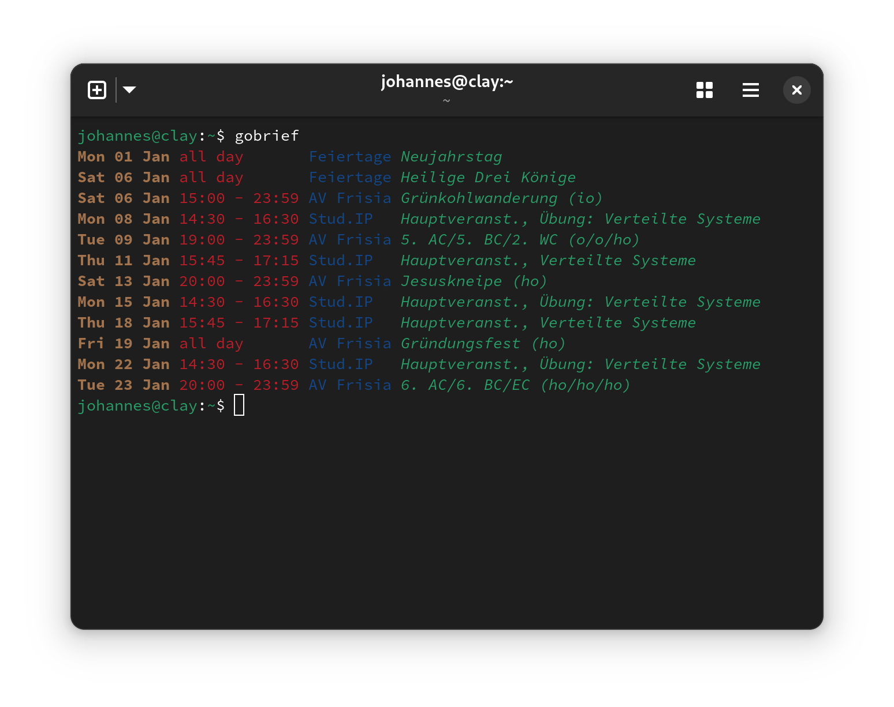

# gobrief
[](https://github.com/j0hax/gobrief/actions/workflows/go.yml)




Preview upcoming calendar events. Think of it as an `ls` command for your agenda.

> [!NOTE]
> This is a very simple project, don't expect too much. It's a bit of a mental-health-meditation-playground thing I work on to destress.

## Method of Operation
1. Read calendar names and URLs from a configuration file
2. Asynchronously fetch events and push them to a minheap
3. Diplay events nicely on `stdout`

I find it incredibly satisfying when a program is efficient, fast, but still readable, which is why I often refactor parts of the source as I achieve my personal programming enlightenment.

## Sample Configuration File

Taken directly from my very own `~/.config/gobrief/config.toml`, this configuration contains two public iCal calendars.

```toml
# Upcoming days to show
Days = 28

# List of calendars
[[Calendars]]
Name = 'AV Frisia'
URL = 'https://intern.avfrisia.de/adm_program/modules/dates/ical_dates.php'
Priority = 0

[[Calendars]]
Name = 'Feiertage'
URL = 'https://onlinekalender.info/feiertage/deutschland.ics'
Priority = 0
```